# 🚀 PlaceDrive – Smart Placement Drive & Recruitment Management System

PlaceDrive is a full-stack web application that digitizes and streamlines the entire campus placement lifecycle—from student registration to final selection—using a centralized, role-based platform.

---

## 🔧 Tech Stack

| Layer | Technology |
|-------|------------|
| Backend | Java 17, Spring Boot, Spring Data JPA |
| Database | MySQL (Workbench) |
| Frontend | HTML, CSS, JavaScript |
| Testing | Postman |

---

## 🧱 Architecture
Frontend (HTML/CSS/JS) → REST APIs (Spring Boot) → MySQL
---

## 👥 User Roles

- **Student** – Browse jobs, apply, track application status
- **Company** – Post jobs, view applicants, update results
- **Admin** – Monitor system, view stats, manage data

---

## ✨ Key Features

- Role-based authentication (Student / Company / Admin)
- Job posting & management
- Smart eligibility check (CGPA-based)
- Application tracking (Applied / Shortlisted / Selected / Rejected)
- Duplicate application prevention
- Job status control (Open / Closed)
- Admin dashboard with live stats

---

## 📦 Project Structure
placementdrive/
├── backend/       # Spring Boot application
└── frontend/      # HTML, CSS, JavaScript
---

## ▶️ How to Run

### 🔹 Backend

```bash
cd placementdrive
mvn spring-boot:run
```

### 🔹 Database

1. Create a database named `placement_db` in MySQL Workbench
2. Update `application.properties` with your MySQL credentials:

```properties
spring.datasource.url=jdbc:mysql://localhost:3306/placement_db
spring.datasource.username=your_username
spring.datasource.password=your_password
```

### 🔹 Frontend

Open `frontend/index.html` in your browser.

### 🔹 API Base URL
http://localhost:8080/api
---

## 📸 Screenshots

### 🔹 Main Page
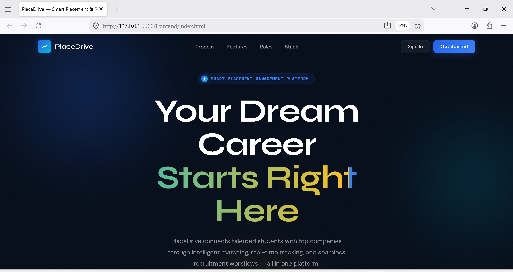

### 🔹 Sign In Page
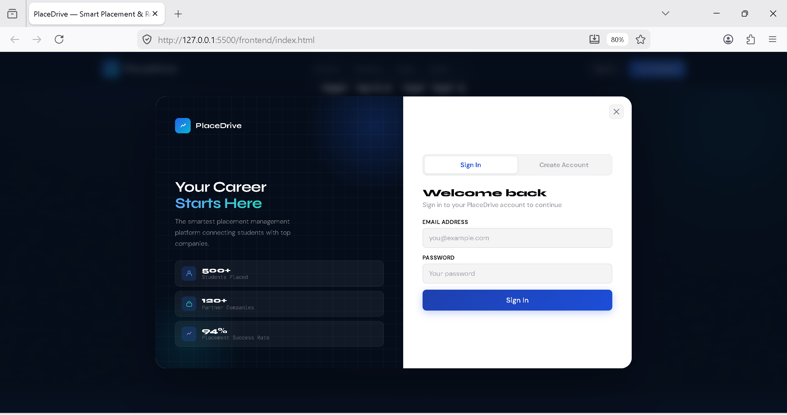

### 🔹 Register Page
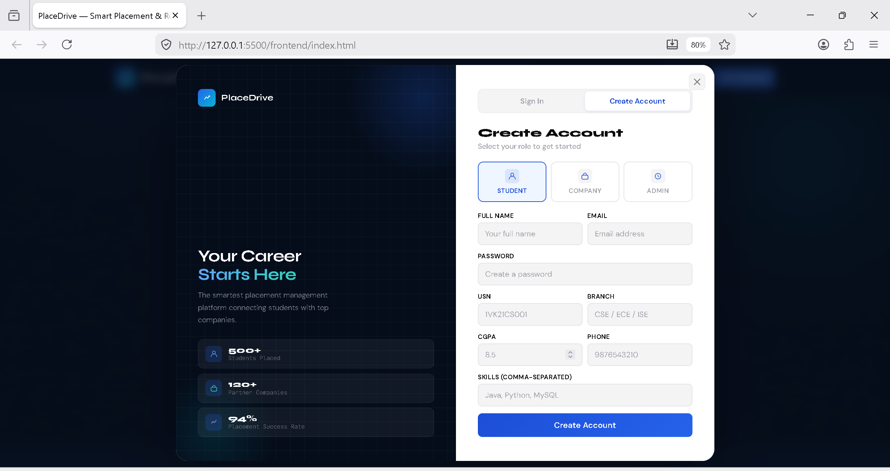

### 🔹 Student Dashboard
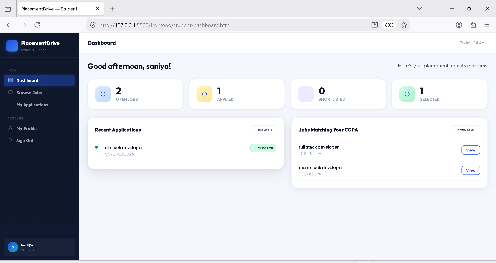

### 🔹 Student Browse Jobs
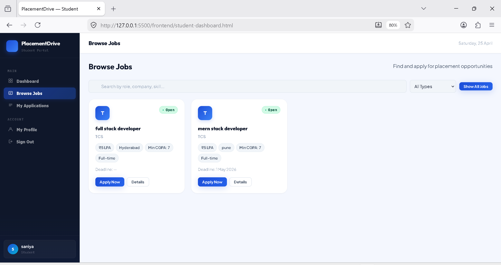

### 🔹 Student Applications
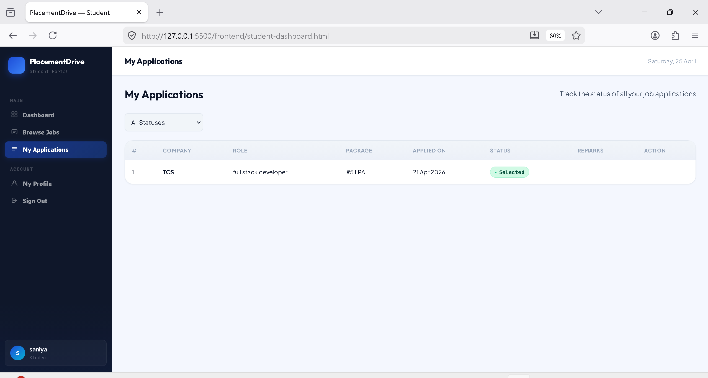

### 🔹 Company Dashboard
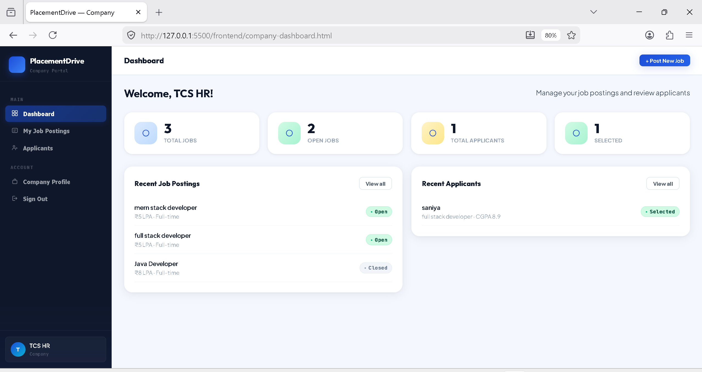

### 🔹 Company Job Postings
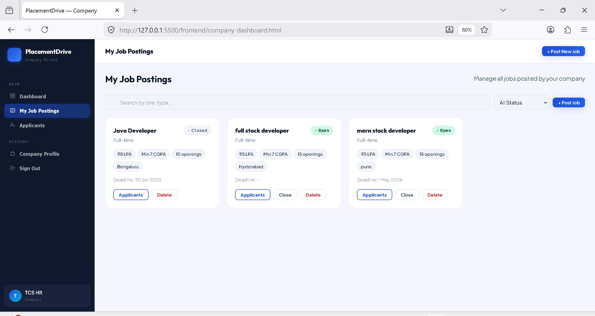

### 🔹 Company Applications
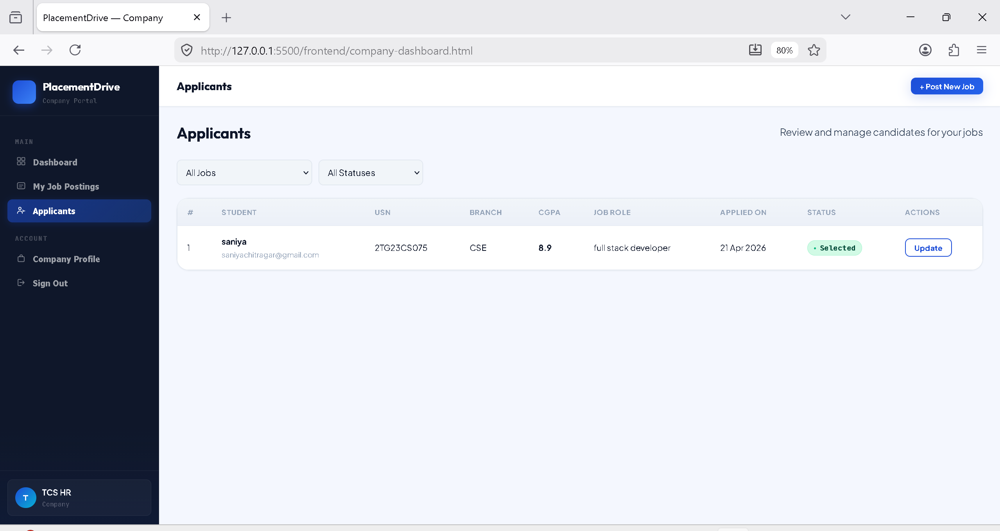

### 🔹 Admin Dashboard
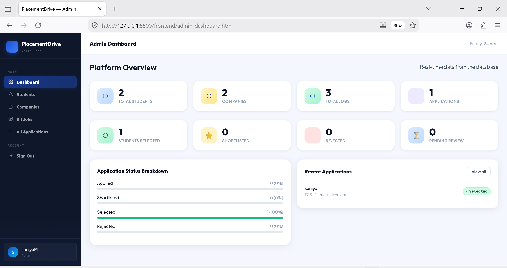

### 🔹 All Jobs (Admin)
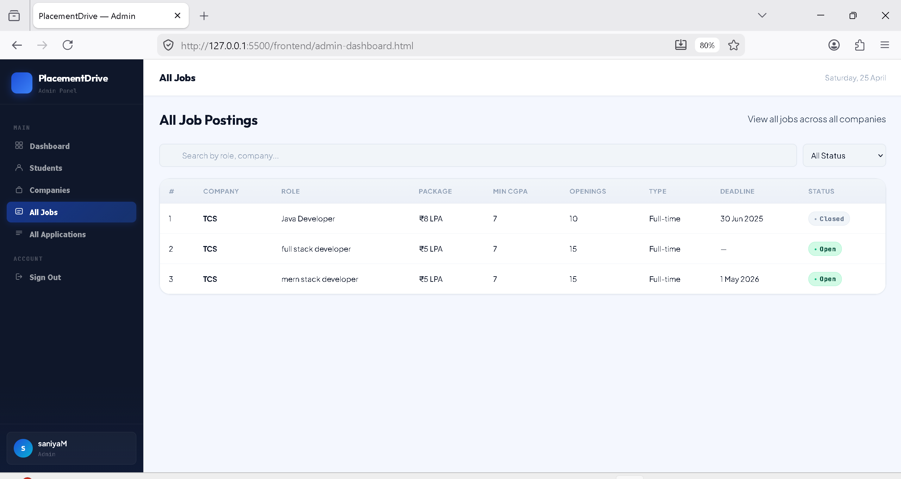

### 🔹 All Students
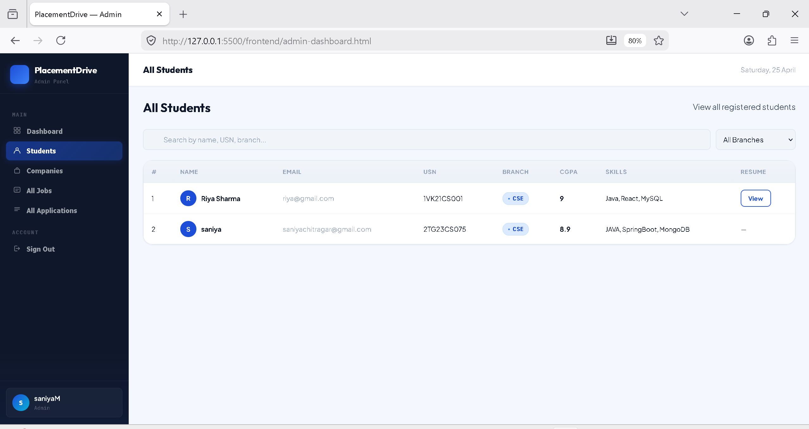

### 🔹 All Companies
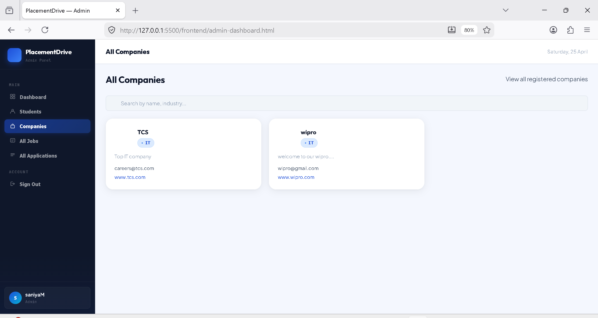

---

## ⚙️ Core Functionalities

- Student registration and profile management
- Company job posting and applicant tracking
- Admin monitoring and analytics dashboard
- Real-time application status updates

---

## 🛡️ Validations Implemented

- Duplicate email prevention
- CGPA eligibility check before applying
- Prevent duplicate job applications
- Job must be **Open** to accept applications
- Role-based access control

---

## 🚀 Future Enhancements

- [ ] Resume upload & parsing
- [ ] Email notifications
- [ ] AI-based candidate filtering
- [ ] Interview scheduling system
- [ ] Mobile application

---

## 📌 Author

**Saniya M Chitragar**